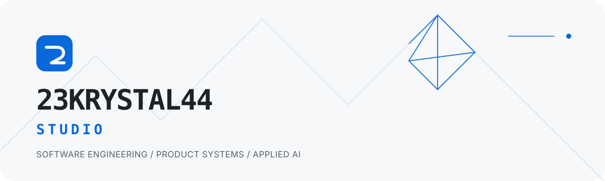

<picture>
  <source media="(prefers-color-scheme: dark)" srcset="./assets/hero-dark.svg">
  <source media="(prefers-color-scheme: light)" srcset="./assets/hero-light.svg">
  
</picture>

### Software with structure.

`23KRYSTAL44-STUDIO` is an independent software practice focused on precise product engineering: native applications, dependable systems, thoughtful automation, and applied AI workflows.

The work starts with a clear problem and ends with software that is calm to use, easy to reason about, and built to last.

## Focus

- **Native product engineering** — Apple-platform applications shaped around real workflows.
- **Private-by-design systems** — local-first architecture, deliberate data handling, and explicit security boundaries.
- **Quality as a feature** — accessibility, testing, documentation, and maintainable delivery pipelines.
- **Practical automation** — tools and AI-assisted workflows that remove repetition without hiding complexity.

## Current Work

Current product development is private while release quality, documentation, and distribution are being prepared. Public projects will appear here when they are ready to be useful—not simply when they are ready to be shown.

## Toolbox

- **Product** · `Swift` `SwiftUI` `SwiftData`
- **Quality** · `Swift Testing` `XCTest` `XCUITest` `Accessibility`
- **Delivery** · `Git` `GitHub Actions` `CI/CD` `Technical documentation`
- **Exploration** · `Python` `Automation` `LLM workflows`

## Studio Principles

`Clarity over ornament.` &nbsp; `Privacy over extraction.` &nbsp; `Evidence over claims.` &nbsp; `Finish over volume.`

---

<strong>23KRYSTAL44-STUDIO</strong> · Independent software engineering
